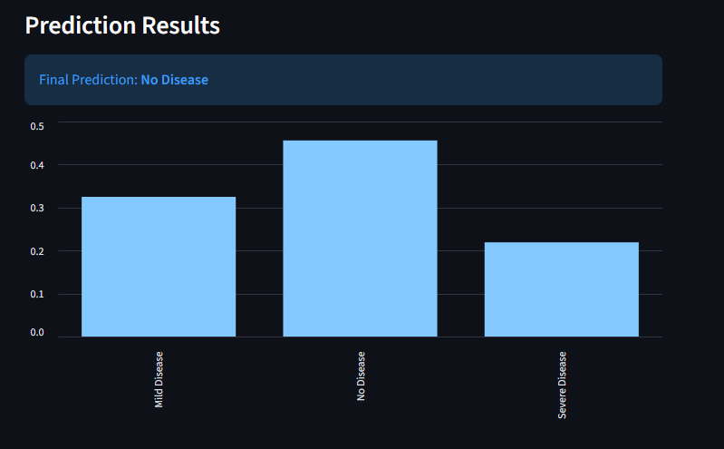
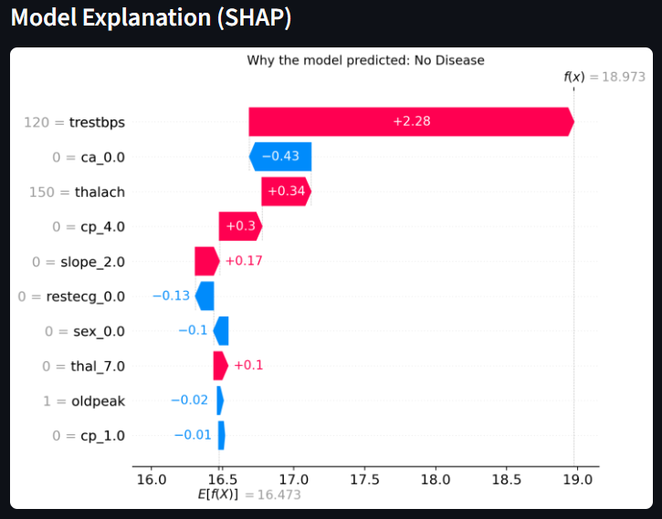

# Interpretable Multi-Stage Heart Disease Classifier

🧠 **Project Overview**  
This research-oriented project implements a machine learning pipeline to predict heart disease severity (No Disease / Mild / Severe) using clinical data from the UCI Cleveland dataset. Unlike standard "black-box" models, it prioritizes clinical interpretability via **Explainable AI (XAI)** — enabling clinicians to understand *why* a prediction was made.

🚀 **Technical Pipeline**
- Preprocessing & Feature Engineering: Automated handling of categorical encoding, scaling, and missing values.
- Imbalance Handling: SMOTE to address class skew in medical data.
- Feature Selection: Recursive Feature Elimination (RFE) → 10 most predictive features (e.g., trestbps, ca, thalach).
- Model: Multinomial Logistic Regression with balanced weights for fair multi-stage classification.
- Interpretability: SHAP integration for global/local explanations (waterfall plots per patient).

📊 **Key Performance Metrics**
- Cross-Validation: Mean accuracy 64% (±0.02) over 5-fold Stratified CV.
- Test Set: 70% accuracy, macro F1-score 0.63 (No Disease F1=0.87, Severe F1=0.55, Mild F1=0.48 reflecting clinical overlap).
- 100% feature-level transparency for every individual prediction.

**Visual Examples**:

**Sample Prediction Output**  

**SHAP Waterfall Plot** – Feature contributions for a sample patient prediction  

🛠 **Tech Stack**  
Python | Scikit-Learn | SHAP | Streamlit | Pandas | Imbalanced-Learn

📄 Preprint & Code: [arXiv link coming soon] | Full code in this repo.

Open to collaborations, feedback, or research opportunities in XAI for healthcare!
